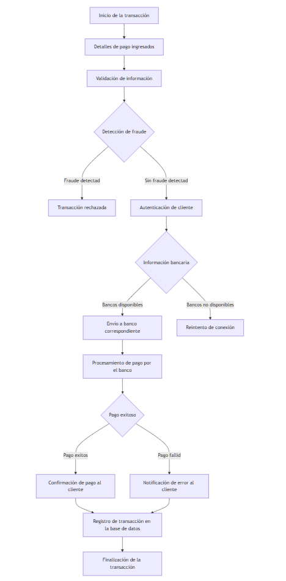

# Solución
## Autor
- [@jennifer-gutierrez](https://github.com/jennifergRSI)
## Descripción del proyecto
El proyecto consiste en diseñar la arquitectura de una pasarela de pago. Una pasarela de pago es un servicio que autoriza y procesa pagos en aplicaciones web y móviles, permitiendo transacciones seguras entre clientes y comerciantes. Los estudiantes deberán considerar aspectos clave como la seguridad de las transacciones, la integración con bancos y sistemas de detección de fraudes, la escalabilidad y la eficiencia.

## Diagrama de Flujo
Requisistos para diseñar el diagrama en Mermaid sobre una pasarela de pago:  
1. Definición de los componentes principales del sistema y cómo interactúan entre sí.
2. Validación de Información: Se verifican los datos de la tarjeta y del cliente.
3. Detección de Fraude: Se incluye un paso de detección de fraude antes de proceder.
4. Autenticación y Envío Bancario: Autenticación del cliente y verificación de disponibilidad del banco.
5. Procesamiento y Confirmación: Si el pago es exitoso, se confirma al cliente; en caso de fallo, se envía una notificación de error.
6. Registro y Finalización: Finalmente, se registra la transacción en la base de datos y se finaliza la transacción.

```
flowchart TD
    A[Inicio de la transacción] --> B[Detalles de pago ingresados]
    B --> C[Validación de información]
    C --> D{Detección de fraude}
    
    D --Fraude detectado--> X[Transacción rechazada]
    D --Sin fraude detectado--> E[Autenticación de cliente]
    E --> F{Información bancaria}
    
    F --Bancos disponibles--> G[Envío a banco correspondiente]
    F --Bancos no disponibles--> H[Reintento de conexión]
    
    G --> I[Procesamiento de pago por el banco]
    I --> J{Pago exitoso}
    J --Pago exitoso--> K[Confirmación de pago al cliente]
    J --Pago fallido--> L[Notificación de error al cliente]
    
    K --> M[Registro de transacción en la base de datos]
    L --> M
    
    M --> N[Finalización de la transacción]
```

Vista de diagrama:



## Diagrama UML
Para crear un diagrama UML para una pasarela de pago, necesitamos definir las clases principales y sus relaciones. Explicación de las clases:
1. PaymentGateway: Clase principal que procesa pagos, autentica usuarios, y detecta posibles fraudes.
2. PaymentDetails: Contiene la información de pago como el monto, moneda y detalles de la tarjeta
3. User: Representa al usuario del sistema que inicia la transacción y puede ser autenticado.
4. Bank: Representa al banco al que se envía la transacción y procesa el pago.
5. FraudDetectionSystem: Detecta posibles fraudes en la transacción.
6. Transaction: Representa una transacción individual y contiene información sobre el estado de la transacción.
7. TransactionStatus: Representa el estado de la transacción, como "exitosa" o "fallida".
8. BankResponse: Representa la respuesta del banco después de procesar la transacción.

```
classDiagram
    class PaymentGateway {
        +processPayment(paymentDetails: PaymentDetails): TransactionStatus
        +authenticateUser(user: User): bool
        +detectFraud(transaction: Transaction): bool
    }
    
    class PaymentDetails {
        +amount: double
        +currency: String
        +cardNumber: String
        +expirationDate: Date
        +cvv: int
    }
    
    class User {
        +userId: String
        +name: String
        +email: String
        +authenticate(): bool
    }
    
    class Bank {
        +bankId: String
        +name: String
        +processTransaction(transaction: Transaction): BankResponse
    }
    
    class FraudDetectionSystem {
        +analyze(transaction: Transaction): bool
    }
    
    class Transaction {
        +transactionId: String
        +status: String
        +timestamp: DateTime
    }
    
    class TransactionStatus {
        +status: String
        +message: String
    }
    
    class BankResponse {
        +isApproved: bool
        +errorCode: String
    }

    PaymentGateway "1" --> "1" FraudDetectionSystem : uses
    PaymentGateway "1" --> "1" Bank : interacts with
    PaymentGateway "1" --> "1" User : authenticates
    PaymentGateway "1" --> "1" Transaction : creates
    PaymentGateway "1" --> "1" PaymentDetails : processes
    
    Bank --> Transaction : processes
    FraudDetectionSystem --> Transaction : analyzes
    User --> Transaction : initiates

```

Vista de diagrama:


## Diagrama de secuencia
Este diagrama de secuencia refleja los componentes clave para el flujo de transacciones en una pasarela de pago, asegurando que se manejen las validaciones y notificaciones de manera ordenada.. Explicación del flujo del diagrama:

1. Inicio de la Transacción: El cliente inicia la transacción enviando los detalles de pago a la pasarela.
2. Autenticación: La pasarela valida los datos y, si es necesario, solicita autenticación al cliente.
3. Detección de Fraude: La pasarela de pago consulta al sistema de detección de fraudes para evaluar el riesgo de la transacción.
4. Verificación Bancaria: Si se aprueba la transacción, se envía una solicitud de pago al banco.
5. Respuesta Bancaria: El banco devuelve una respuesta indicando si la transacción fue aprobada o rechazada.
6. Confirmación al Cliente: Finalmente, se notifica al cliente sobre el estado de la transacción y se cierra la sesión.

```
sequenceDiagram
    participant Cliente
    participant PasarelaDePago
    participant SistemaDeteccionFraude
    participant Banco

    Cliente ->> PasarelaDePago: Iniciar transacción (detalles de pago)
    PasarelaDePago ->> Cliente: Validación de datos del cliente
    Cliente ->> PasarelaDePago: Enviar detalles de autenticación

    PasarelaDePago ->> SistemaDeteccionFraude: Verificar riesgo de fraude
    SistemaDeteccionFraude -->> PasarelaDePago: Respuesta de detección de fraude (aprobado/rechazado)
    
    alt Transacción aprobada por detección de fraude
        PasarelaDePago ->> Banco: Enviar solicitud de transacción
        Banco -->> PasarelaDePago: Respuesta de la transacción (aprobado/rechazado)
        
        alt Transacción aprobada por el banco
            PasarelaDePago ->> Cliente: Confirmación de pago exitoso
            PasarelaDePago ->> PasarelaDePago: Registrar transacción
        else Transacción rechazada por el banco
            PasarelaDePago ->> Cliente: Notificación de error en la transacción
        end
    else Transacción rechazada por detección de fraude
        PasarelaDePago ->> Cliente: Notificación de transacción rechazada por fraude
    end

    Cliente ->> PasarelaDePago: Cerrar sesión


```

Vista de diagrama:


## Diagrama de Estados
Este diagrama cubre los principales estados que atraviesa una transacción en una pasarela de pago, desde la validación inicial hasta la notificación final al cliente. Explicación de los Estados:

1. IniciandoTransaccion: La pasarela comienza a procesar una nueva transacción.
2. ValidandoDatos: Se valida la información del cliente y los detalles del pago.
3. AutenticandoCliente: Si la información es válida, el cliente se autentica.
4. VerificandoFraude: Se realiza una verificación de fraude para evaluar el riesgo de la transacción.
5. ConectandoBanco: Si la transacción pasa el control de fraude, se conecta con el banco para procesar el pago.
6. ProcesandoPago: El banco procesa la transacción.
7. PagoExitoso: Si el pago es aprobado, se registra y notifica al cliente.
8. TransaccionRechazada: La transacción es rechazada ya sea por fraude, autenticación fallida, o rechazo del banco.

```
stateDiagram-v2
    [*] --> IniciandoTransaccion
    
    IniciandoTransaccion --> ValidandoDatos : Datos recibidos
    ValidandoDatos --> AutenticandoCliente : Datos válidos
    ValidandoDatos --> ErrorValidacion : Datos inválidos
    ErrorValidacion --> [*]
    
    AutenticandoCliente --> VerificandoFraude : Autenticación exitosa
    AutenticandoCliente --> ErrorAutenticacion : Autenticación fallida
    ErrorAutenticacion --> [*]
    
    VerificandoFraude --> TransaccionRechazada : Riesgo de fraude detectado
    VerificandoFraude --> ConectandoBanco : No se detecta fraude

    ConectandoBanco --> ProcesandoPago : Banco disponible
    ConectandoBanco --> ErrorConexionBanco : Banco no disponible
    ErrorConexionBanco --> [*]
    
    ProcesandoPago --> PagoExitoso : Transacción aprobada
    ProcesandoPago --> TransaccionRechazada : Transacción rechazada por el banco
    
    PagoExitoso --> RegistrandoTransaccion : Pago exitoso registrado
    RegistrandoTransaccion --> NotificandoCliente
    NotificandoCliente --> [*]
    
    TransaccionRechazada --> NotificandoCliente : Notificación de rechazo
    NotificandoCliente --> [*]
```

Vista de diagrama:


## Estructura del proyecto
La estructura mantiene los módulos organizados y facilita la escalabilidad y el mantenimiento de la pasarela de pago. Explicación de la Estructura de Carpetas:
* config/: Almacena los archivos de configuración necesarios para ejecutar la aplicación, como la configuración general y la base de datos.
* src/: Contiene el código fuente principal de la pasarela de pago, organizado en:
    * controllers/: Define los controladores que gestionan las solicitudes y respuestas HTTP.
    * services/: Incluye servicios que implementan la lógica de negocio, como la gestión de pagos, autenticación y detección de fraudes.
    * models/: Representa las entidades de datos de la aplicación.
    * repositories/: Proporciona acceso a la base de datos mediante repositorios específicos.
    * utils/: Almacena herramientas de utilidad, como funciones de encriptación, validación y logging.
    * middleware/: Contiene middlewares que interceptan solicitudes para autenticación y manejo de errores.
    * integrations/: Define las integraciones con APIs externas, como los servicios bancarios y sistemas de detección de fraudes.
* logs/: Carpeta destinada a almacenar los archivos de registro.
* tests/: Contiene pruebas para los controladores, servicios e integraciones, asegurando la funcionalidad de cada componente.

```
PaymentGateway/
├── config/
│   ├── application.yml        # Configuración general de la aplicación
│   └── database.yml           # Configuración de la base de datos
│
├── src/
│   ├── controllers/           # Controladores que manejan las solicitudes HTTP
│   │   ├── PaymentController
│   │   └── AuthController
│   │
│   ├── services/              # Servicios con la lógica de negocio
│   │   ├── PaymentService
│   │   ├── AuthService
│   │   ├── FraudDetectionService
│   │   └── TransactionService
│   │
│   ├── models/                # Modelos de datos
│   │   ├── User
│   │   ├── Payment
│   │   ├── Transaction
│   │   ├── BankResponse
│   │   └── FraudCheck
│   │
│   ├── repositories/          # Repositorios para la interacción con la base de datos
│   │   ├── UserRepository
│   │   ├── PaymentRepository
│   │   └── TransactionRepository
│   │
│   ├── utils/                 # Utilidades generales
│   │   ├── EncryptionUtils    # Herramientas de encriptación
│   │   ├── ValidationUtils    # Validaciones de datos
│   │   └── LoggingUtils       # Logging y auditoría
│   │
│   ├── middleware/            # Middlewares para autenticación y manejo de errores
│   │   ├── AuthMiddleware
│   │   └── ErrorHandlingMiddleware
│   │
│   └── integrations/          # Integraciones externas
│       ├── BankAPIIntegration
│       └── FraudDetectionAPIIntegration
│
├── logs/                      # Archivos de log para auditoría y monitoreo
│   ├── payment_logs.log
│   ├── error_logs.log
│   └── access_logs.log
│
└── tests/                     # Pruebas de unidad e integración
    ├── controllers/
    ├── services/
    └── integrations/

```